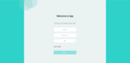

<div id="top"></div>

<!-- PROJECT LOGO -->
<br />
<div align="center">
  <a href="https://github.com/othneildrew/Best-README-Template">
    
  </a>

  <h3 align="center">Tips manager</h3>

  <p align="center">
    React tips calculator with React, Typescript and Styled Components library!
  </p>
</div>

<!-- ABOUT THE PROJECT -->

## About The Project


Educational project in order to get used to building SPA via React with Typescript's typing and Styled Components styles.

<p align="right">(<a href="#top">back to top</a>)</p>

### Built With

- [![React][react.js]][react-url]
- [](https://github.com/styled-components/styled-components)
- 
- [react-select](https://github.com/JedWatson/react-select)

<p align="right">(<a href="#top">back to top</a>)</p>

### Prerequisites

```
You will need installed Node package manager(npm) on your computer.
```

### Installation

#### 1. Clone application

```
git clone https://github.com/igorslepenkov/react-tips-calculator.git
```

#### 2. Intall dependencies

```
npm install
```

#### 3. Run application

```
npm start
```

## Contact

Your Name - [My LinkedIn](https://linkedin.com/in/игорь-слепенков-b17704198)

Project Link: [https://github.com/igorslepenkov/react-tips-calculator](https://github.com/igorslepenkov/react-tips-calculator)

Deploy link: [https://igorslepenkov.github.io/react-tips-calculator/](https://igorslepenkov.github.io/react-tips-calculator/)

<p align="right">(<a href="#top">back to top</a>)</p>

<!-- MARKDOWN LINKS & IMAGES -->
<!-- https://www.markdownguide.org/basic-syntax/#reference-style-links -->

[react.js]: https://img.shields.io/badge/React-20232A?style=for-the-badge&logo=react&logoColor=61DAFB
[react-url]: https://reactjs.org/
